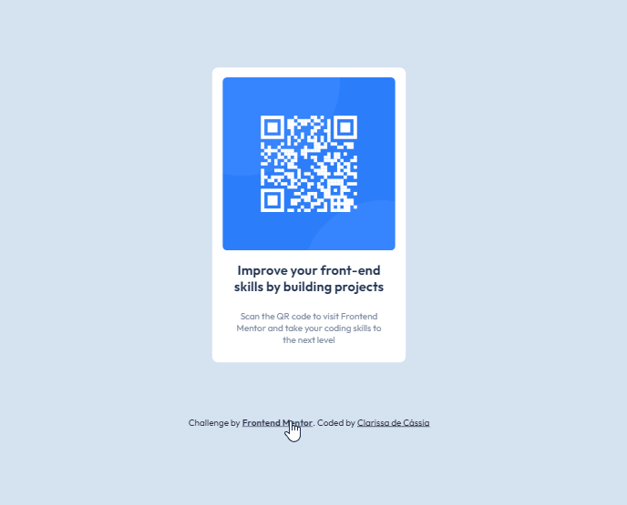

# Projeto-QR-code

## Sobre o projeto
O projeto consiste na criação de uma página da web simples usando as tecnologias: HTML, CSS e JavaScript . O principal objetivo é permitir que os usuários insiram um conteúdo específico e, em resposta, o sistema gere um código QR correspondente.
 ## Layout

 

 

 

## Tecnologias utilizadas

- HTML 
- CSS 
-Javascript

## O que eu aprendi
Neste projeto, aprimorei os conhecimentos no uso de tags semanticas,estilizações e o uso de display flex.Com uso de Javascript pudo colocar a lógica em prática, com o uso do setTimeout  e  com funções construidas para funcionalidades interativas.

## Acesso a página

Para ver o projeto pronto [clique aqui ](https://claricassia.github.io/Projeto-QR-code/)

